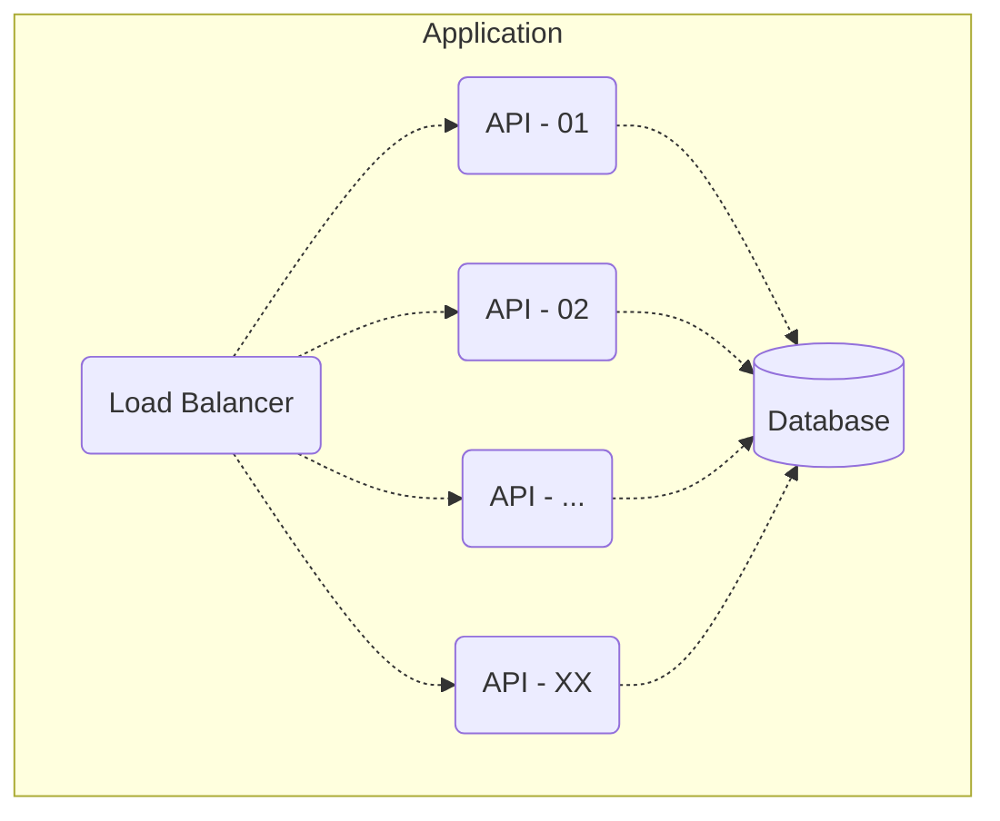

# Akkamelo: A Resilient, Fast, Distributed API in Scala with Akka

**Akkamelo** is a learning project aimed at building a resilient and distributed API using Scala and Akka. The project is based on the concepts of concurrency, fault-tolerance, and scalability. Initially inspired by the backend challenge "Rinha de Backend", this API focuses on managing credits and debits in a multi-client environment while ensuring data consistency.

## Project Overview

The main goals of this project include:

- **Concurrency**: Handle multiple concurrent transactions while maintaining consistency.
- **Resilience**: Create an API capable of withstanding failures and errors without compromising functionality and speed.
- **Speed**: Ensure low-latency responses by optimizing request handling and minimizing processing time, even under high load.
- **Concurrency Management**: Enforce credit and debit rules, ensuring that debits cannot result in negative balances beyond predefined limits.

## Architecture

The system consists of multiple components, including:

- **Load Balancer**: Distributes HTTP traffic across the instances of the API service. It listens on port 9999.
- **API Services**: Multiple instances of the API service run behind the load balancer to handle client requests.
- **Database**: A relational database for storing client data, transactions, and balance information.

## Technologies Used

- **Scala**: The main programming language used to build the API.
- **Akka**: A toolkit for building highly concurrent, distributed, and resilient message-driven systems.
- **Docker**: Used for containerization and ensuring consistent environments.
- **Database**: **_TBD_**.
- **Load Balancer**: **_TBD_**.

## Constraints

As per the "[Rinha de Backend](https://github.com/zanfranceschi/rinha-de-backend-2024-q1)" challenge, **akkamelo** must operate within the following resource limitations:

- **Memory**: The entire program is constrained to a maximum of **550 MB** of RAM. Memory usage must be tightly controlled to prevent crashes and ensure efficient handling of requests.
- **CPU**: The total CPU usage across all API instances must not exceed **1.5 vCPUs**. This necessitates careful CPU management.

These resource constraints add an additional layer of challenge, driving the need for optimization to ensure the system remains responsive, resilient, and scalable.

## Contributors

This project was built collaboratively by:

- Me
- add your names here guys

---

This project is a learning experiment and follows the guidelines set by the "Rinha de Backend" contest, even though we are not officially participating.
